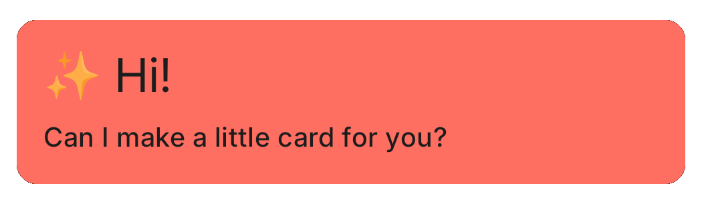
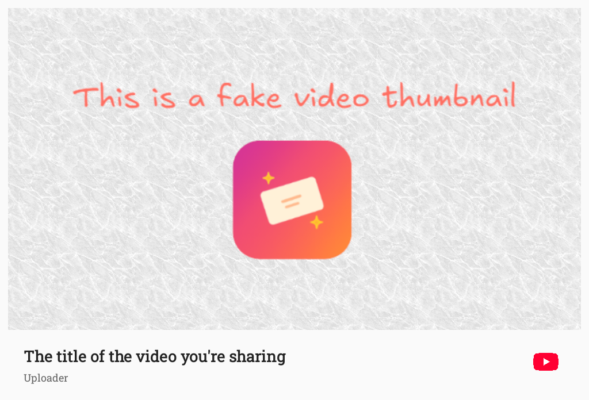

# Little Card

A small tool built to remove a bit of the hassle from sharing YouTube videos to Instagram Stories.

It creates a nice image "card" out of a YouTube video link, which can be added to a Story along with the link, making the story more visually appealing.

- Not affiliated with YouTube or Instagram.
- Uses only public APIs, in accordance with their terms of service.
- Does not collect or store any data.

## What it does

- Creates a "card" - an image out of a YouTube video link you provide.
- The image is the video thumbnail, with the video title and channel name added along with a border.
- The Android app shares the image directly to the Instagram Story Editor.

## Limitations

- It would be nice to share a brief excerpt of the video or audio, but that's very much against YouTube's terms of service.
- We could use YouTube's video preview animations, but those aren't exposed via the Data API. Their ID, too, is obfuscated, so guessing them isn't an option either.
- The image shared to Instagram is just an image, not a link. The user has to add the link manually, which is a UX hassle we can only mitigate. It is not possible to create a link sticker programmatically.

## Roadmap

We use [GitHub Issues](https://github.com/Botffy/little-card/issues) to track features and bugs.

Long term roadmap:

- Create cards for YouTube Music links.
- Create cards for any URL (using the Open Graph metadata).
- Have a web app version.

## Getting it

The app is in closed testing phase. If you'd like to try it, email [armin@sarmin-softworks.hu](mailto:armin@sarmin-softworks.hu?subject=Little%20Card%20testing), and I will add you to the tester list.

Alternatively, download the APK from the latest [release](https://github.com/Botffy/little-card/releases).

## Development

Little Card is an Android app built with Kotlin and Jetpack Compose.
See [the app Readme](./android/README.md) for development instructions.

## Copyright & License

Little Card was created by Ármin Scipiades, under the moniker Sarmin Softworks.

Little Card is licensed under the [MIT License](./LICENSE).
